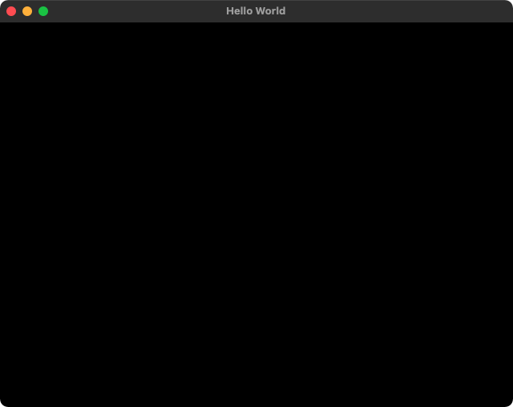
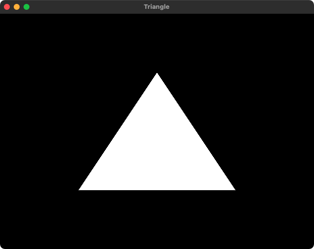

# OpenGL
A set of OpenGL examples built on macOS.

Every example so far can be compiled using:
```bash
clang -framework OpenGL main.cpp -o app libglfw.3.dylib 
```
Some issues related to macOS are addressed [here](https://www.lukechikkala.com/post/opengl-on-macos).

## 0_Window
Creates an empty window.



## 1_Triangle
Renders a triangle.


