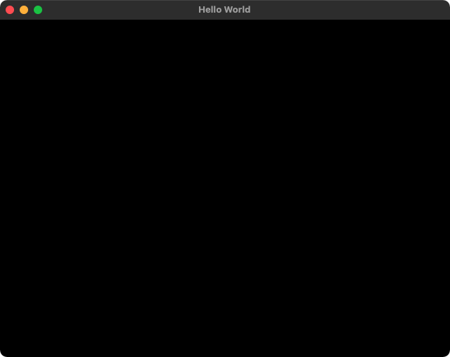
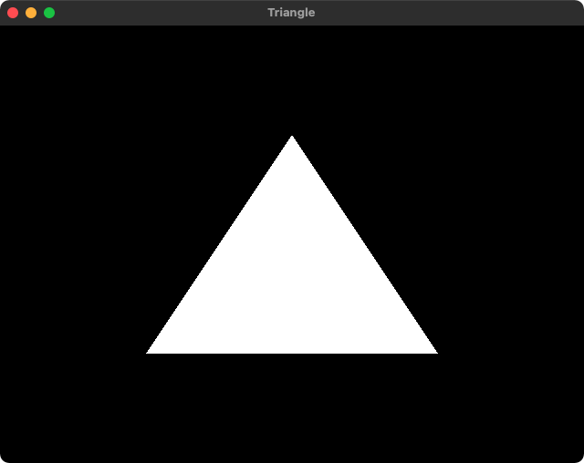
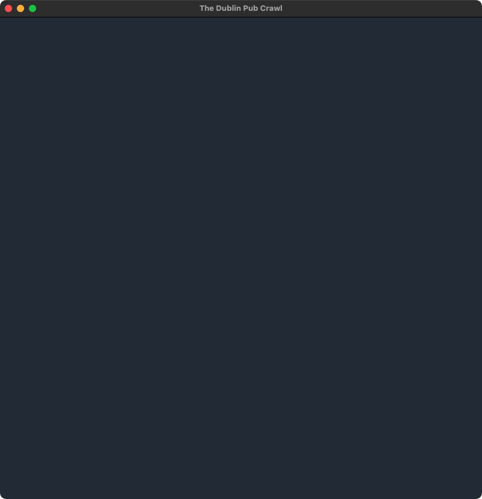
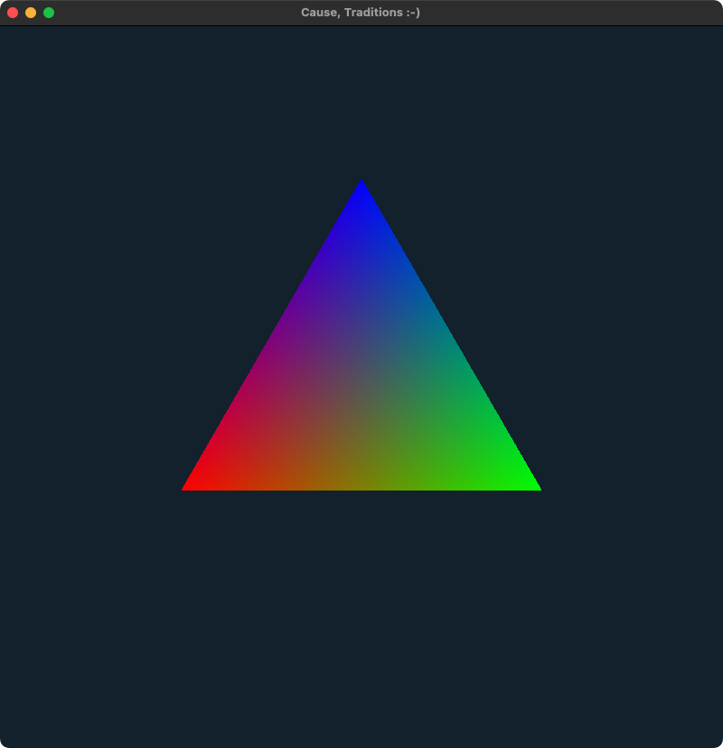
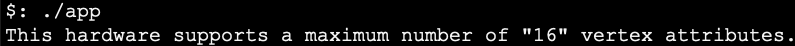
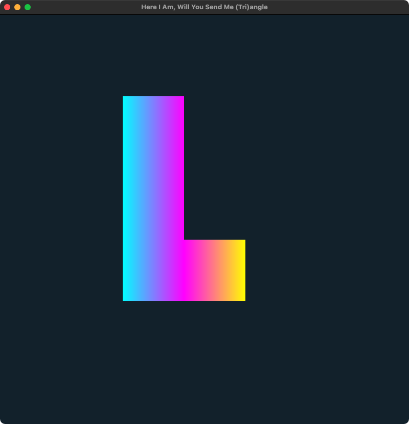

# OpenGL
A set of OpenGL examples built on macOS.

Every example so far can be compiled using:
```bash
clang -framework OpenGL main.cpp -o app libglfw.3.dylib 
```
Some issues related to macOS are addressed [here](https://www.lukechikkala.com/post/opengl-on-macos).

## 0_Window
Creates an empty window.



## 1_Triangle
Renders a triangle.



## 2_Window_Color
There's no triangle for this time, but this demo shows how a window's color can be modified.



## 3_Triangle_Color
The triangle is back but now with a different color built with the help of some vertex & fragment shader code.


## 4_Shaders
This example shows how to use vertex attributes with both position and color data.



## 5_Find_Max_Vertex_Attributes
The amount of Vertex Attributes declarable are limited by hardware.<br>
This can be retrieved by using `GL_MAX_VERTEX_ATTRIBS`.<br>
This example shows how this method can be called.



## 6_Separate_Shaders
Example shows how to run shaders in their own files and be called through `main.cpp` using our Shader class.<br>
The output of this program will and should look precisely the same as 4_Shaders.<br>
The only difference is how we call our shaders.

## 7_Mehr_Dreiecke
This example shows the use of `E`lement `B`uffer `O`bjects.
EBO allows us to store only the unique vertix coordinates in the buffer.
All the common vertex attributes can be ignored.
Doing this provides each vertex coordinate with an index.
We then use indices to tell OpenGL how the triangles should be drawn.

Since the idea of this example is to show Element Buffer Objects in the most simplest form, the shaders are written within the `main.cpp`.

:bangbang: Order of vertex declaration and order of index calling are extremely important. :bangbang:<br>
:bangbang: See [this](7_Mehr_Dreiecke/docs/bts_coordinates.png) to get a behind-the-scenes idea of how coordinates are called in `main.cpp` :bangbang:


## 8_Mehr_Dreiecke_Color
This example is the same as 7_Mehr_Dreiecke except this time we also invlove fragment shader to take care of each vertex's color.

