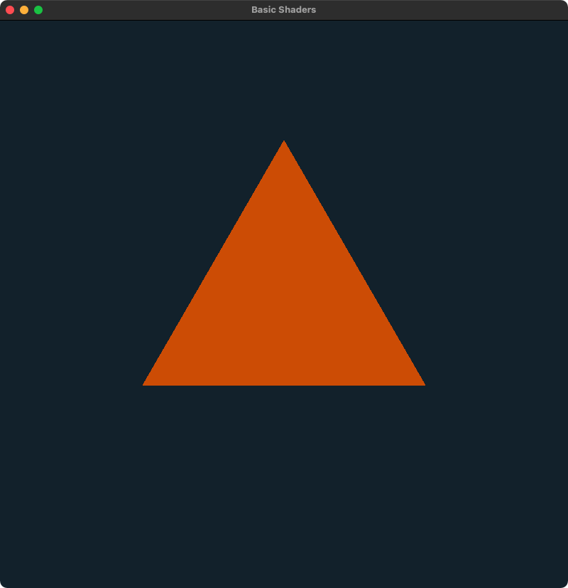

# OpenGL
A set of OpenGL examples built on macOS.

Every example so far can be compiled using:
```bash
clang -framework OpenGL main.cpp -o app libglfw.3.dylib 
```
Some issues related to macOS are addressed [here](https://www.lukechikkala.com/post/opengl-on-macos).

## 0_Window
Creates an empty window.


## 1_Triangle
Renders a triangle.


## 2_Window_Color
There's no triangle for this time, but this demo shows how a window's color can be modified.


## 3_Triangle_Color
The triangle is back but now with a different color built with the help of some vertex & fragment shader code.



## 4_Shaders
This example shows how to use vertex attributes with both position and color data.


